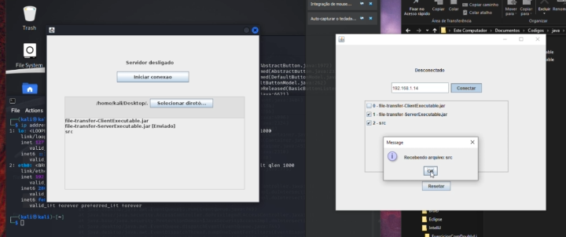

# file-transfer-GUI

Aplicação em java para transferência de arquivos entre dispositivos na mesma rede por sockets.  

Um dispositivo agirá como o servidor, selecionando a pasta de arquivos que quer compartilhar e então iniciando o socket para aguardar a conexão do cliente.  

O dispositivo cliente deve digitar o IP do servidor e então se conectar, uma vez para receber a lista de arquivos e então novamente para receber os arquivos selecionados utilizando as checkboxes.

